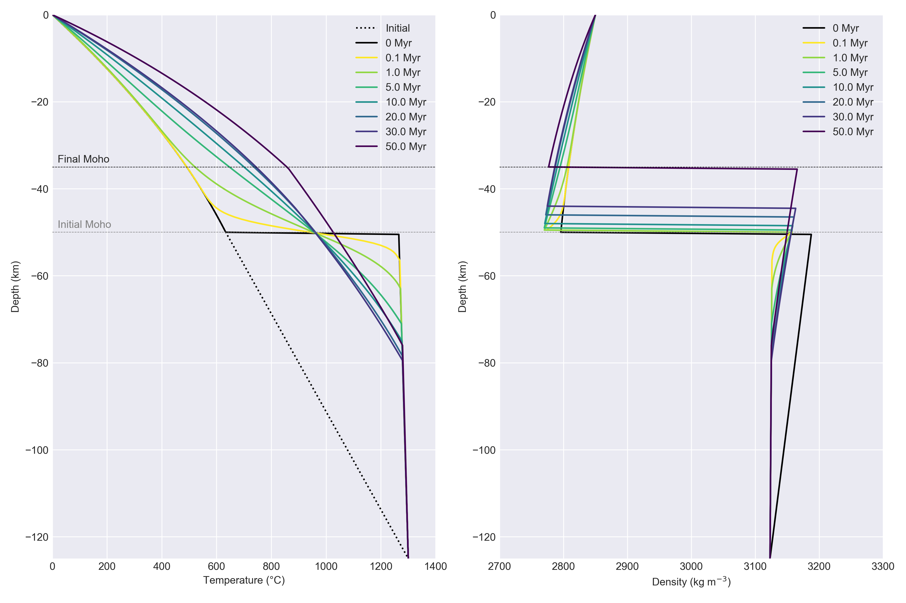
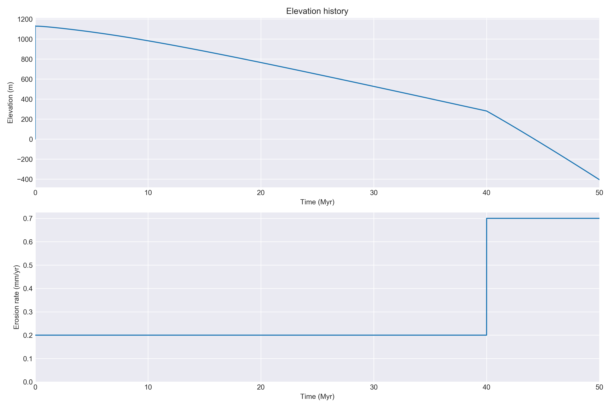
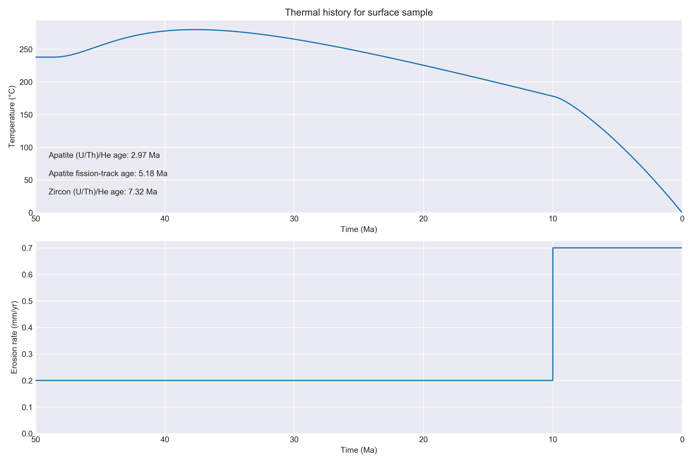

# TC1D - A 1D thermal and thermochronometer age prediction model

[](https://tc1d.readthedocs.io/en/latest/?badge=latest)
[](https://www.gnu.org/licenses/gpl-3.0)

T<sub>c</sub>1D is a one-dimensional thermal and thermochronometer age prediction model that can simulate the effects of various geodynamic and geomorphic processes on thermochronometer ages.
It currently supports prediction of apatite and zircon (U-Th)/He and fission-track ages.

### Example plots (click to enlarge)

<a href="png/T_rho_hist.png"></a>&nbsp;
<a href="png/elev_hist.png"></a>&nbsp;
<a href="png/cooling_hist.png"></a>

## Getting started

### Compiling the age-prediction programs

In order to use the code, you should first compile the thermochronometer age prediction codes in the `c` and `cpp` directories. From the base code directory you can do the following in a terminal:

```bash
cd c
make && make install
cd ..

cd cpp
make && make install
cd ..
```

This will build the age prediction programs and install them in the `bin` directory. Note that you may need to edit the `Makefile` in the `c` and `cpp` subdirectories to specify your compilers.

### Running the model

The main program can be run from the command line as follows:

```bash
cd py
./TC1D.py
```

This will run the code with the default options. The main program is written in Python 3, and assumes that the NumPy, Matplotlib, and SciPy libraries are installed in your Python environment.

### Changing the model parameters

A full list of options that can be given to the main program can be found by typing

```bash
./TC1D.py --help
```

## References

Flowers, R. M., Ketcham, R. A., Shuster, D. L., & Farley, K. A. (2009). Apatite (U-Th)/He thermochronometry using a radiation damage accumulation and annealing model. Geochimica et Cosmochimica Acta, 73(8), 2347--2365.

Guenthner, W. R., Reiners, P. W., Ketcham, R. A., Nasdala, L., & Giester, G. (2013). Helium diffusion in natural zircon: Radiation damage, anisotropy, and the interpretation of zircon (U-Th)/He thermochronology. American Journal of Science, 313(3), 145–198. https://doi.org/10.2475/03.2013.01

Ketcham, R. A., Carter, A., Donelick, R. A., Barbarand, J., & Hurford, A. J. (2007). Improved modeling of fission-track annealing in apatite. American Mineralogist, 92(5–6), 799--810.
