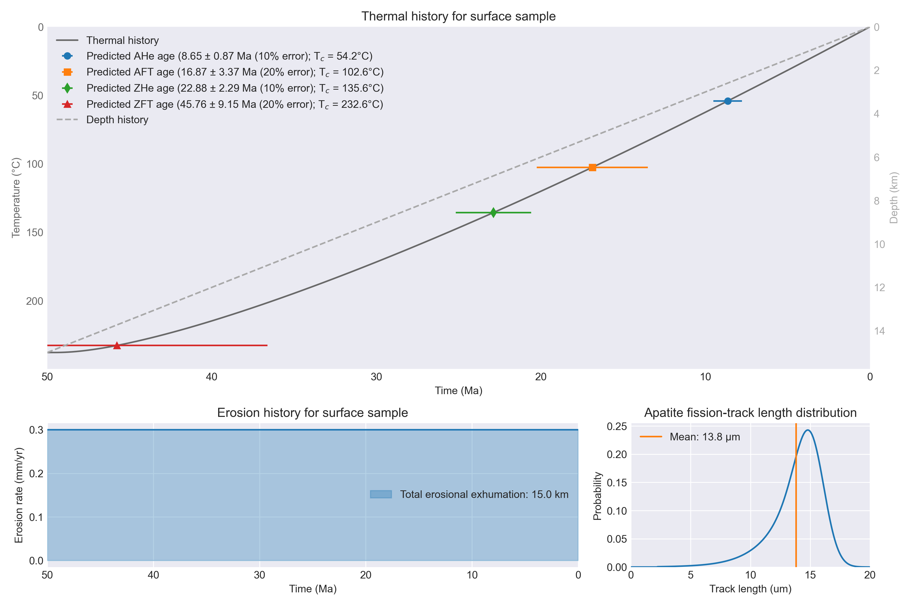

# Erosion models

## Overview

There are several options for how erosion can be defined in the T<sub>c</sub>1D thermal models.
Options for the erosion rate calculation include:

1. Constant erosion rate
2. Constant rate with a step-function change at a specified time
3. Exponential decay
4. Emplacement and erosional removal of a thrust sheet
5. Tectonic exhumation and erosion
6. Linear increase in erosion rate from a specified starting time
7. Extensional tectonics

Below is a general description of how erosion is implemented in the code as well as details about how each option works.

## General implementation

The calculation of erosion rates in T<sub>c</sub>1D is done in a function titled `calculate_erosion_rate()`. The function definition statement is below, to give you a sense of the values that can be passed to the function:

```python
def calculate_erosion_rate(params, dt, t_total, current_time, x, vx_array, fault_depth, moho_depth):
    """Defines the way in which erosion should be applied."""
    ...
    return vx_array, vx_surf, vx_max, fault_depth
```

The function expects the following values to be passed:

- `params`: The T<sub>c</sub>1D model parameters dictionary. Relevant parameters include:
    - `params["ero_type"]`: The type of erosion model to be used
        - `1` = Constant erosion rate
        - `2` = Constant rate with a step-function change at a specified time
        - `3` = Exponential decay
        - `4` = Thrust sheet emplacement/erosion
        - `5` = Tectonic exhumation and erosion
        - `6` = Linear rate change
        - `7` = Extensional tectonics
    - `params["ero_option1"]`, `params["ero_option2"]`, `...`: Optional parameters depending on the selected erosion model
- `dt`: The model time step in years
- `t_total`: The total model run time in Myr
- `current_time`: The current time in the model
- `x`: The model spatial coordinates (depths)
- `vx_array`: The array of velocities across the model depth range
- `fault_depth`: The depth of the fault in erosion model 7 (ignored for other erosion models)
- `moho_depth`: The current depth to the model Moho

The function returns the following values:

- `vx_array`: The array of velocities across the model depth range
- `vx_surf`: The velocity at the model surface
- `vx_max`: The magnitude of the maximum velocity in the model
- `fault_depth`: The depth of the fault in erosion model 7 (ignored for other erosion models)

Details about the implementation of the erosion model options can be found below.

### Type 1: Constant erosion rate

<br/>
*Example cooling history for the constant erosion rate erosion model.*

The constant erosion rate case is used by defining `params["ero_type"] = 1`.

It is the simplest option in T<sub>c</sub>1D and defined using one parameter:

- `params["ero_option1"]`: the erosion magnitude $m$ (in km). `15.0` was used in the plot above.

The calculated value for the erosion rate $\dot{e}$ is simply the erosion magnitude divided by the simulation time ($\dot{e} = m / t_{\mathrm{total}}$).

### Type 2: Constant rate(s) with step-function change(s) at specified time(s)

<br/>
*Example cooling history for the constant rates with step-function changes at specified times erosion model.*

The constant rate(s) with step-function change(s) at specified time(s) case is used by defining `params["ero_type"] = 2`.

This model is designed to have up to two to three periods of constant erosion rates with one to two times at which the rate changes.
The parameters used in this case are:

- `params["ero_option1"]`: the exhumation magnitude $m_{1}$ (in km) for the first phase. `10.0` was used in the plot above.
- `params["ero_option2"]`: the time $t_{1}$ (model time in Myr) of the first transition in erosion rate. `10.0` was used in the plot above.
- `params["ero_option3"]`: the exhumation magnitude $m_{2}$ (in km) for the second phase. `3.0` was used in the plot above.
- `params["ero_option4"]` (*optional*): the time $t_{2}$ (model time in Myr) of the second transition in erosion rate. `40.0` was used in the plot above.
- `params["ero_option5"]` (*optional*): the exhumation magnitude $m_{3}$ (in km) for the third phase. `5.0` was used in the plot above.

**Note**: If `ero_option4` and `ero_option5` are not specified, only one transition in rate will occur.

Similar to the constant erosion rate model, the erosion rates here are calculated as the erosion magnitudes divided a time duration.
For two-stage models, the rates $\dot{e}$ are:

- Rate 1: $\dot{e}_{1} = m_{1} / t_{1}$
- Rate 2: $\dot{e}_{2} = m_{2} / (t_{\mathrm{total}} - t_{1}$)

For three-stage models, the rates $\dot{e}$ are:

- Rate 1: $\dot{e}_{1} = m_{1} / t_{1}$
- Rate 2: $\dot{e}_{2} = m_{2} / (t_{2} - t_{1}$)
- Rate 3: $\dot{e}_{3} = m_{3} / (t_{\mathrm{total}} - t_{2}$)

### Type 3: Exponential decay

<br/>
*Example cooling history for the exponential decay erosion model.*

The exponential decay case is used by defining `params["ero_type"] = 3`.

The exponential decay erosion model works by calculating a maximum erosion rate $\dot{e}_{\mathrm{max}}$ based on the magnitude of exhumation $m$ and the characteristic time of exponential decay $t_{e}$.
The user inputs both $m$ and $t_{e}$ (the time over which the erosion rate should decay exponentially to $1/e$ times the original value), and the code determines the erosion rate that will result.
The maximum erosion rate $\dot{e}_{\mathrm{max}}$ is calculated as:

$$
\begin{equation}
\dot{e}_{\mathrm{max}} = \frac{m}{t_{e} - \exp{(-t_{\mathrm{total}} / t_{e})}}.
\end{equation}
$$

Two erosion model parameters are used for this case:

- `params["ero_option1"]`: the exhumation magnitude (in km). `15.0` was used in the plot above.
- `params["ero_option2"]`: the characteristic time (in Myr). `20.0` was used in the plot above.

The resulting erosion rate as a function of time $\dot{e}_{t}$ can be calculated as

$$
\begin{equation}
\dot{e}_{t} = 
\end{equation}
$$

### Type 4: Emplacement and erosional removal of a thrust sheet

Coming soon :)

### Type 5: Tectonic exhumation and erosion

Coming soon :)

### Type 6: Linear increase in erosion rate from a specified time

This model is designed to have a linear increase in erosion rate from a starting rate to a final rate over a specified time window.


### Elevation-dependent erosion

Elevation-dependent erosion has not yet been implemented.

## Notes

1. It would be good to ensure that in the step model the initial erosion phase doesn't result in erosion of the entire difference in Moho height. There should at least be a warning printed to the screen in these cases.
