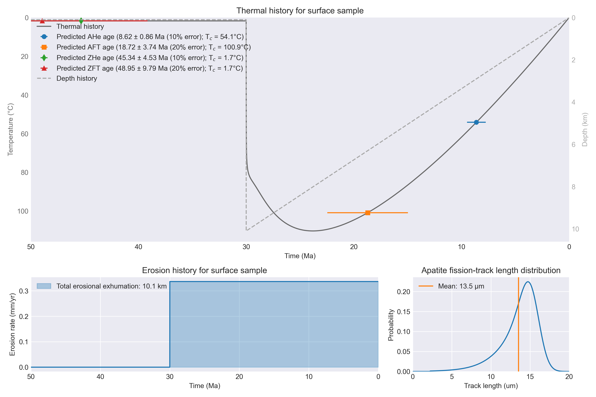
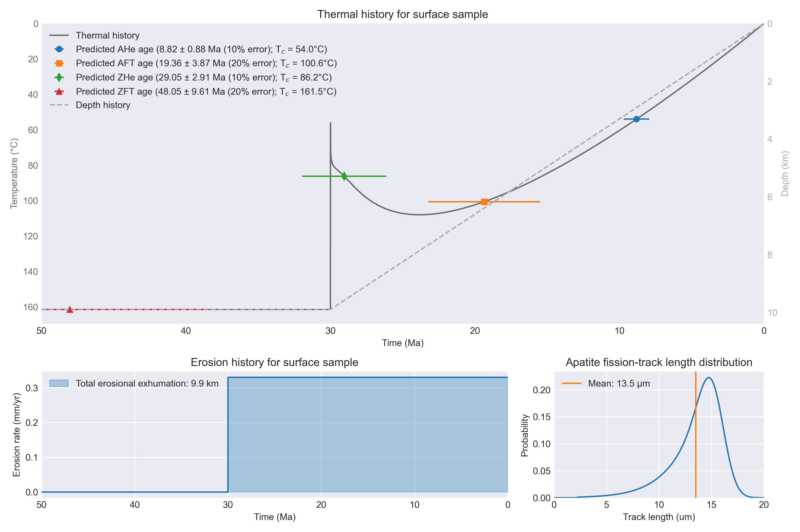
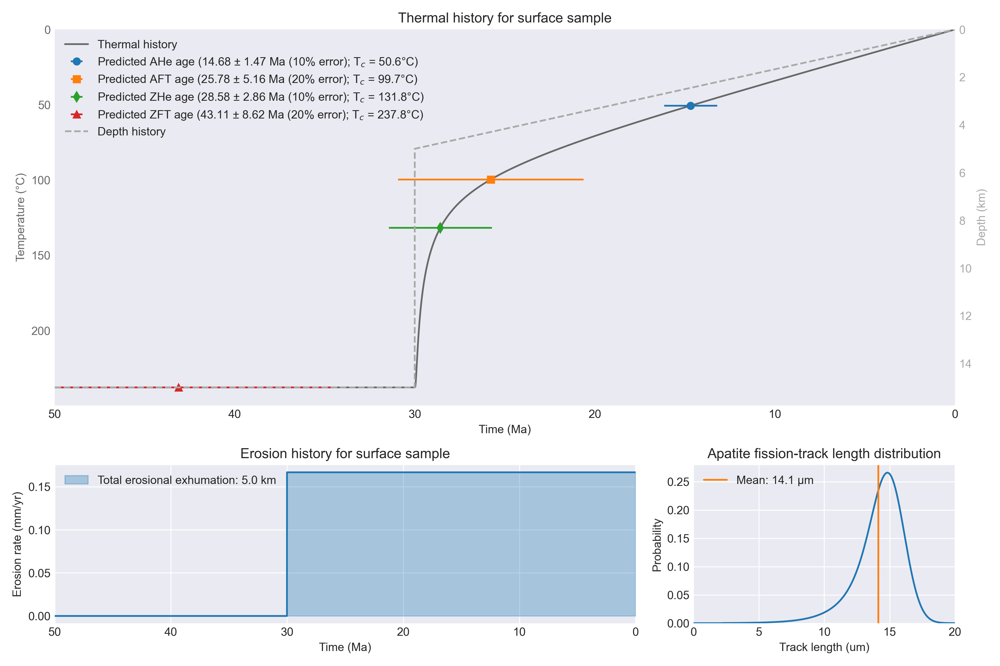
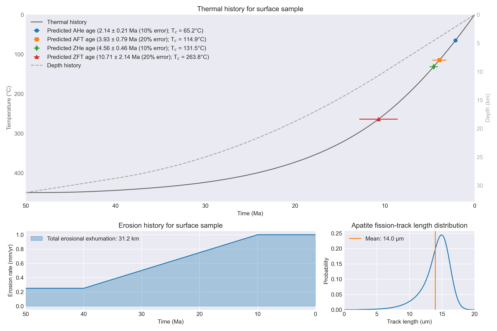

# Erosion models

## Overview

There are several options for how erosion can be defined in the T<sub>c</sub>1D thermal models.
Options for the erosion rate calculation include:

1. [Constant erosion rate](#type-1-constant-erosion-rate)
2. [Constant rate with a step-function change at a specified time](#type-2-constant-erosion-rate-with-step-function-changes-at-one-or-more-times)
3. [Exponential decay](#type-3-exponential-decay)
4. [Emplacement and erosional removal of a thrust sheet](#type-4-emplacement-and-erosional-removal-of-a-thrust-sheet)
5. [Tectonic exhumation and erosion](#type-5-tectonic-exhumation-and-erosion)
6. [Linear increase in erosion rate from a specified starting time](#type-6-linear-change-in-erosion-rate-from-a-specified-time)
7. [Extensional tectonics](#type-7-extensional-tectonics)

Below is a general description of how erosion is implemented in the code as well as details about how each option works.

## General implementation

The calculation of erosion rates in T<sub>c</sub>1D is done in a function titled `calculate_erosion_rate()`. The function definition statement is below, to give you a sense of the values that can be passed to the function:

```python
def calculate_erosion_rate(params, dt, t_total, current_time, x, vx_array, fault_depth, moho_depth):
    """Defines the way in which erosion should be applied."""
    ...
    return vx_array, vx_surf, vx_max, fault_depth
```

The function expects the following values to be passed:

- `params`: The T<sub>c</sub>1D model parameters dictionary. Relevant parameters include:
    - `params["ero_type"]`: The type of erosion model to be used
        - `1` = Constant erosion rate
        - `2` = Constant rate with a step-function change at a specified time
        - `3` = Exponential decay
        - `4` = Thrust sheet emplacement/erosion
        - `5` = Tectonic exhumation and erosion
        - `6` = Linear rate change
        - `7` = Extensional tectonics
    - `params["ero_option1"]`, `params["ero_option2"]`, `...`: Optional parameters depending on the selected erosion model
- `dt`: The model time step in years
- `t_total`: The total model run time in Myr
- `current_time`: The current time in the model
- `x`: The model spatial coordinates (depths)
- `vx_array`: The array of velocities across the model depth range
- `fault_depth`: The depth of the fault in erosion model 7 (ignored for other erosion models)
- `moho_depth`: The current depth to the model Moho

The function returns the following values:

- `vx_array`: The array of velocities across the model depth range
- `vx_surf`: The velocity at the model surface
- `vx_max`: The magnitude of the maximum velocity in the model
- `fault_depth`: The depth of the fault in erosion model 7 (ignored for other erosion models)

Details about the implementation of the erosion model options can be found below.
Note: All plots below use `invert_tt_plot = True` and `plot_depth_history = True`.

### Type 1: Constant erosion rate

<br/>
*Example cooling history for the constant erosion rate erosion model.*

The constant erosion rate case is used by defining `params["ero_type"] = 1`.

It is the simplest option in T<sub>c</sub>1D and defined using one parameter:

- `params["ero_option1"]`: the erosion magnitude $m$ (in km). `15.0` was used in the plot above.

The calculated value for the erosion rate $\dot{e}$ is simply the erosion magnitude divided by the simulation time ($\dot{e} = m / t_{\mathrm{total}}$).

### Type 2: Constant erosion rate with step-function changes at one or more times

<br/>
*Example cooling history for the constant rates with step-function changes at specified times erosion model.*

The constant rate(s) with step-function change(s) at specified time(s) case is used by defining `params["ero_type"] = 2`.

This model is designed to have up to two to three periods of constant erosion rates with one to two times at which the rate changes.
The parameters used in this case are:

- `params["ero_option1"]`: the exhumation magnitude $m_{1}$ (in km) for the first phase. `10.0` was used in the plot above.
- `params["ero_option2"]`: the time $t_{1}$ (model time in Myr) of the first transition in erosion rate. `10.0` was used in the plot above.
- `params["ero_option3"]`: the exhumation magnitude $m_{2}$ (in km) for the second phase. `3.0` was used in the plot above.
- `params["ero_option4"]` (*optional*): the time $t_{2}$ (model time in Myr) of the second transition in erosion rate. `40.0` was used in the plot above.
- `params["ero_option5"]` (*optional*): the exhumation magnitude $m_{3}$ (in km) for the third phase. `5.0` was used in the plot above.

**Note**: If `ero_option4` and `ero_option5` are not specified, only one transition in rate will occur.

Similar to the constant erosion rate model, the erosion rates here are calculated as the erosion magnitudes divided a time duration.
For two-stage models, the rates $\dot{e}$ are:

$$
\dot{e}(t) = 
\begin{cases}
    m_{1} / t_{1}, & \text{if } t \lt t_{1}\\
    m_{2} / (t_{\mathrm{total}} - t_{1}), & \text{otherwise}
\end{cases}
$$

For three-stage models, the rates $\dot{e}$ are:

$$
\dot{e}(t) = 
\begin{cases}
    m_{1} / t_{1}, & \text{if } t \lt t_{1}\\
    m_{2} / (t_{2} - t_{1}), & \text{if } t_{1} \leq t \lt t_{2}\\
    m_{3} / (t_{\mathrm{total}} - t_{2}), & \text{otherwise}
\end{cases}
$$

where $t$ is the current model time.

### Type 3: Exponential decay

<br/>
*Example cooling history for the exponential decay erosion model.*

The exponential decay case is used by defining `params["ero_type"] = 3`.

The exponential decay erosion model works by calculating a maximum erosion rate $\dot{e}_{\mathrm{max}}$ based on the magnitude of exhumation $m$, the characteristic time of exponential decay $\uptau$, and the onset time for exhumation $t_{\mathrm{start}}$.
The user inputs $m$ and $\uptau$ (the time over which the erosion rate should decay exponentially to $1/e$ times the original value), and optionally the value for $t_{\mathrm{start}}$.
The code determines the erosion rate that will result.
The maximum erosion rate $\dot{e}_{\mathrm{max}}$ is calculated as:

$$
\begin{equation}
\dot{e}_{\mathrm{max}} = \frac{m}{\uptau - \exp{(-(t_{\mathrm{total}} - t_{\mathrm{start}}) / \uptau)}}.
\end{equation}
$$

Two to three erosion model parameters are used for this case:

- `params["ero_option1"]`: the exhumation magnitude (in km). `15.0` was used in the plot above.
- `params["ero_option2"]`: the characteristic time (in Myr). `20.0` was used in the plot above.
- `params["ero_option3"]`: (*optional*) the time at which exponential erosion begins $t_{\mathrm{start}}$ (model time in Myr). `0.0` was used in the plot above.

The resulting erosion rate as a function of time $\dot{e}(t)$ can be calculated as

$$
\dot{e}(t) = 
\begin{cases}
    0, & \text{if } t \lt t_{\mathrm{start}}\\
    \dot{e}_{\mathrm{max}} \exp{(-(t - t_{\mathrm{start}})/ \uptau)}, & \text{otherwise}
\end{cases}
$$

where $t$ is the current model time.

### Type 4: Emplacement and erosional removal of a thrust sheet

<br/>
*Example footwall cooling history for the emplacement and erosional removal of a thrust sheet model.*

<br/>
*Example hanging wall cooling history for the emplacement and erosional removal of a thrust sheet model.*

The emplacement and erosional removal of a thrust sheet case is used by defining `params["ero_type"] = 4`.

This model is based on the models of {cite:t}`Oxburgh1974` and {cite:t}`Davy1986` (among others), where a thrust sheet of a finite thickness is instantaneously emplaced and cools as the thrust sheet and footwall are eroded.
To identify whether the cooling history of the hanging wall or footwall should be recorded, it is possible to specify the position of the tracked particle above or below the thrust sheet.
In addition, it is possible to specify when the thrust sheet is emplaced and when erosion begins in the model.
The parameters used in this case are:

- `params["ero_option1"]`: the thickness of the thrust sheet $m_{1}$ (in km). `10.0` was used in both plots above.
- `params["ero_option2"]`: the additional magnitude of erosion below the thrust sheet $m_{2}$ (in km). `0.1` was used in the upper plot above, and `-0.1` in the lower plot.
- `params["ero_option3"]`: (*optional*) the time at which the thrust sheet is emplaced $t_{\mathrm{thrust}}$ (model time in Myr). `20.0` was used in both plots above.
- `params["ero_option4"]` (*optional*): the time $t_{\mathrm{ero}}$ (model time in Myr) at which the thrust sheet and footwall begin eroding. `20.0` was used in both plots above.

The resulting erosion rate as a function of time $\dot{e}(t)$ can be calculated as

$$
\begin{equation}
\dot{e}(t) = \frac{m_{1} + m_{2}}{t_\mathrm{total} - t_{\mathrm{ero}}},
\end{equation}
$$

where $t$ is the current model time.

### Type 5: Tectonic exhumation and erosion

<br/>
*Example cooling history for the tectonic exhumation and erosion model.*

The tectonic exhumation and erosion case is used by defining `params["ero_type"] = 5`.

This model assumes an instantaneous amount of tectonic exhumation occurs at a given time and that additional exhumation can occur by erosion over a specified time period.
The parameters used in this case are:

- `params["ero_option1"]`: the depth of instantaneous tectonic exhumation $m_{1}$ (in km). `10.0` was used in the plot above.
- `params["ero_option2"]`: the additional magnitude of erosion $m_{2}$ (in km). `5.0` was used in the plot above.
- `params["ero_option3"]`: (*optional*) the time at which instantaneous tectonic exhumation occurs $t_{\mathrm{exh}}$ (model time in Myr). `20.0` was used in the plot above.
- `params["ero_option4"]` (*optional*): the time $t_{\mathrm{ero}}$ (model time in Myr) at which erosional exhumation begins. `20.0` was used in the plot above.

The resulting erosion rate as a function of time $\dot{e}(t)$ can be calculated as

$$
\begin{equation}
\dot{e}(t) = \frac{m_{2}}{t_\mathrm{total} - t_{\mathrm{ero}}},
\end{equation}
$$

where $t$ is the current model time.

### Type 6: Linear change in erosion rate from a specified time

<br/>
*Example cooling history for the linear change in erosion rate from a specified time model.*

The linear change in erosion rate case is used by defining `params["ero_type"] = 6`.

This model has a linear change in erosion rate from a starting rate to a final rate over a specified time window.
The parameters used in this case are:

- `params["ero_option1"]`: the erosion rate for the initial stage $\dot{e}_{1}$ (in mm/yr). `0.25` was used in the plot above.
- `params["ero_option2"]`: the time at which the erosion rate begins changing linearly $t_{1}$ (model time in Myr). `10.0` was used in the plot above.
- `params["ero_option3"]`: the erosion rate at the end of the simulation or for the final stage $\dot{e}_{2}$ (in mm/yr). `1.0` was used in the plot above.
- `params["ero_option4"]` (*optional*): the time $t_{2}$ (model time in Myr) at which the final erosion rate is reached. `40.0` was used in the plot above.

The value for $t_{2}$ is assigned the total model run time $t_{\mathrm{total}}$ if no value is given for `params["ero_option4"]`.
The erosion rates for the linear change phase can thus be calculated as 

$$
\dot{e}(t) = 
\begin{cases}
    \dot{e}_{1}, & \text{if } t \lt t_{1}\\
    \dot{e}_{1} + \frac{t - t_{1}}{t_{2} - t_{1}} (\dot{e}_{2} - \dot{e}_{1}), & \text{if } t_{1} \leq t \lt t_{2}\\
    \dot{e}_{2}, & \text{otherwise}
\end{cases}
$$

where $t$ is the current model time.

### Type 7: Extensional tectonics

<br/>
*Example cooling history for the extensional tectonics model.*

The extensional tectonics case is used by defining `params["ero_type"] = 7`.

The extensional tectonics model is slightly more complex than the others as the velocity varies as a function of depth.
The main model features are defined using four model parameters, as shown in the figure below.

<br/>
*Extensional tectonics model geometry and parameters.*

As shown above, the model requires definition of the fault slip rate, slip partitioning, and geometry.
The fault depth will change with time following the velocity of the footwall.
This basically assumes that the reference frame for a sample reaching the surface is on the footwall vertically above the sample.
In other words, although there are no horizontal velocities in the model, all horizontal motion is assumed to occur in the hanging wall.

In addition to the geometric and fault parameters above, it is possible to define time periods with a constant erosion rate before and after the extensional fault becomes active.
This allows exhumation before and after fault activity.

The complete list of parameters used for this case are:

- `params["ero_option1"]`: the fault slip rate $v$ (in mm/yr). `1.5` was used in the plot above.
- `params["ero_option2"]`: the partitioning factor between hanging wall and footwall motion $\lambda$. A value of $\lambda = 0$ corresponds to a fixed footwall (only motion in hanging wall), and a value of $\lambda = 1.0$ corresponds to a fixed hanging wall (only motion in footwall). `0.5` was used in the plot above.
- `params["ero_option3"]`: the dip angle $\gamma$ of the fault (in degrees). `60.0` was used in the plot above.
- `params["ero_option4"]`: the fault depth at the start of the simulation $b$ (should be a positive number in km). `10.0` was used in the plot above.
- `params["ero_option5"]` (*optional*): the erosion rate for the initial stage $\dot{e}_{1}$ (in mm/yr). `0.1` was used in the plot above.
- `params["ero_option6"]` (*optional*): the time at which the extensional fault model becomes active $t_{1}$ (model time in Myr). `10.0` was used in the plot above.
- `params["ero_option7"]` (*optional*): the erosion rate for the final stage $\dot{e}_{2}$ (in mm/yr) after the extensional fault model deactivates. `0.1` was used in the plot above.
- `params["ero_option8"]` (*optional*): the time $t_{2}$ (model time in Myr) at which the final erosion stage begins. `40.0` was used in the plot above.

Thus, the erosion rates for the different model stages are:

$$
\dot{e}(t) = 
\begin{cases}
    \dot{e}_{1}, & \text{if } t \lt t_{1}\\
    \lambda v \sin{\gamma}, & \text{if } t_{1} \leq t \lt t_{2}\\
    \dot{e}_{2}, & \text{otherwise}
\end{cases}
$$

where $t$ is the current model time.

### Elevation-dependent erosion

Elevation-dependent erosion has not yet been implemented.

## Notes

1. It would be good to ensure that in the step model the initial erosion phase doesn't result in erosion of the entire difference in Moho height. There should at least be a warning printed to the screen in these cases.

## References

```{bibliography}
```
