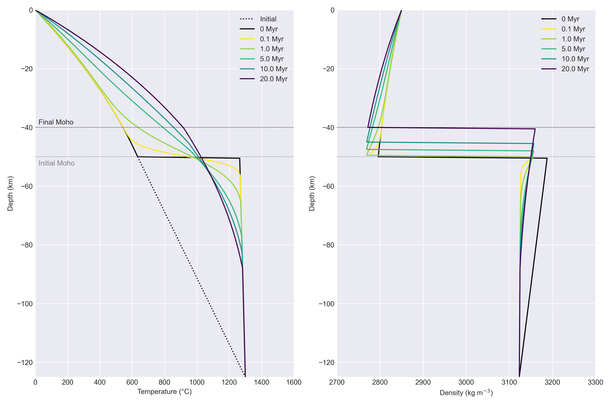
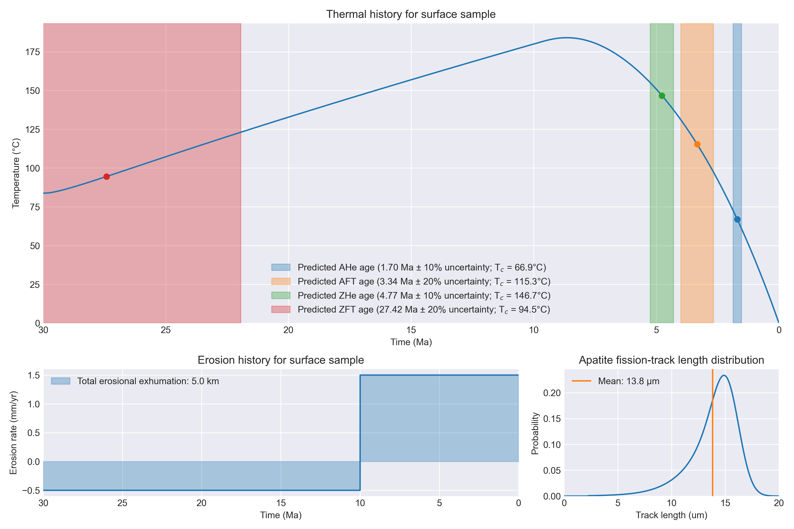
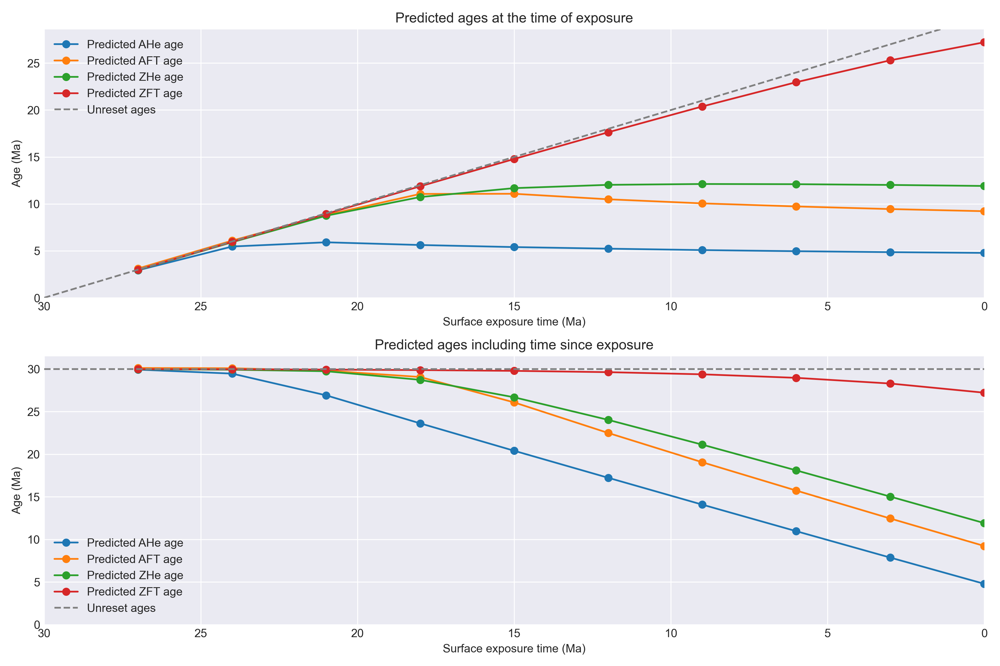

# Plot examples

```{note}
  Not all example plots are from the same model!
```

## Temperature and density history



## Surface elevation history


## Cooling history and predicted ages



## Ages at the model surface through time

