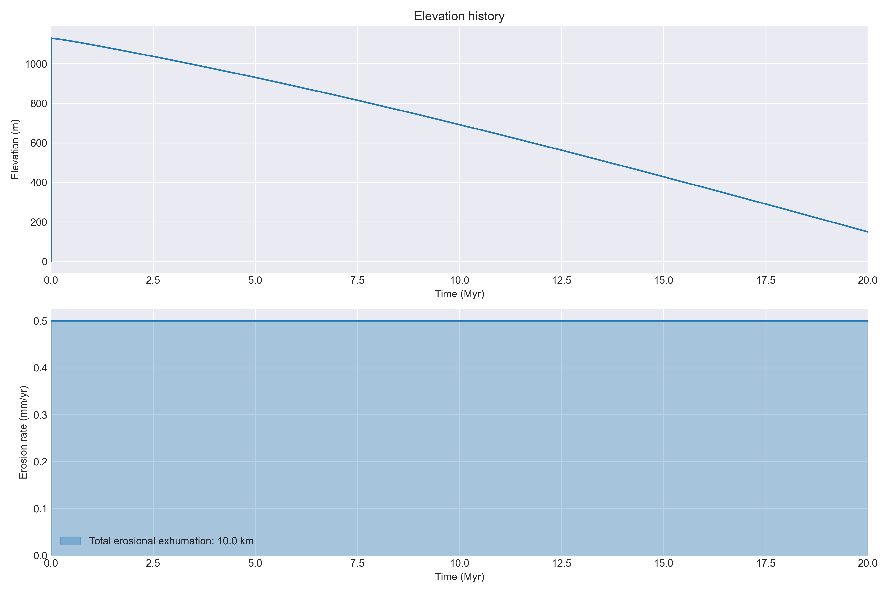

# Plot examples

```{note}
  Not all example plots are from the same model!
```

## Temperature and density history


## Surface elevation history



## Cooling history and predicted ages


## Ages at the model surface through time

