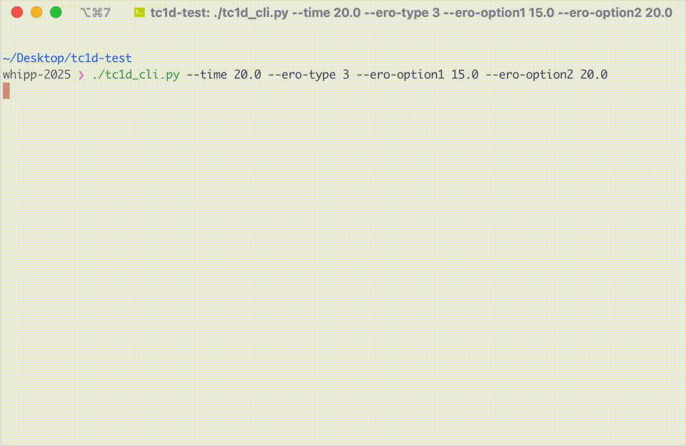

Documentation for T\ :sub:`c`\ 1D
=================================

T\ :sub:`c`\ 1D is a one-dimensional thermal and thermochronometer age prediction model that can simulate the effects of various geodynamic and geomorphic processes on thermochronometer ages.
It currently supports prediction of apatite and zircon (U-Th)/He and fission-track ages.

Check out the :doc:`usage` section for further information, including
details about :ref:`installation`.

.. note::

   This project is under active development.

Contents
--------

.. toctree::
   :caption: Using Tc1D
   :maxdepth: 2

   usage
   example-plots

.. toctree::
   :caption: Reference
   :maxdepth: 2

   reference
